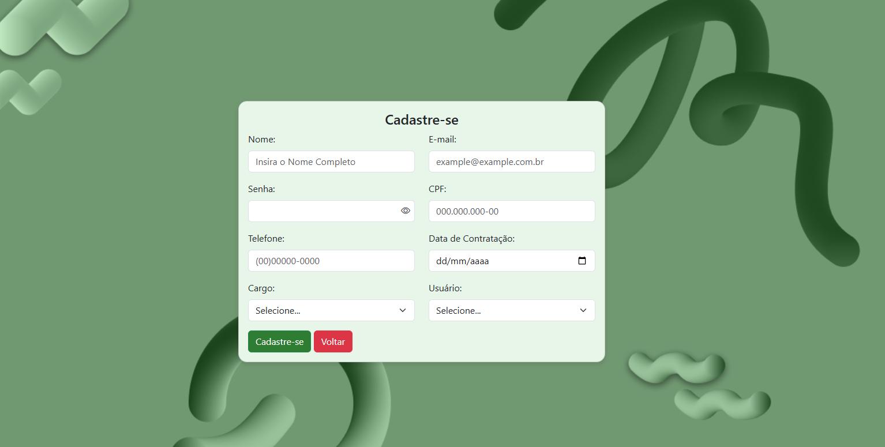

# 🚀 Sistema CRUD de Funcionários  

Um sistema web completo para **gerenciamento de funcionários**, desenvolvido em **PHP + MySQL**, com interface responsiva e código limpo.  
Ideal para estudos, portfólios ou uso em pequenas empresas.  

---

## 📸 Preview





## 🧩 Sumário

- [📘 Visão Geral](#-visão-geral)
- [⚙️ Funcionalidades](#️-funcionalidades)
- [🛠️ Tecnologias Utilizadas](#️-tecnologias-utilizadas)
- [📂 Estrutura do Projeto](#-estrutura-do-projeto)
- [🧱 Banco de Dados](#-banco-de-dados)
- [🚀 Instalação e Configuração](#-instalação-e-configuração)
- [💻 Como Usar](#-como-usar)
- [🔒 Segurança e Boas Práticas](#-segurança-e-boas-práticas)
- [🤝 Contribuição](#-contribuição)
- [📜 Licença](#-licença)
- [👨‍💻 Autor](#-autor)

---

## 📘 Visão Geral

Este projeto implementa um **CRUD (Create, Read, Update, Delete)** de funcionários, com recursos de cadastro, listagem, edição e exclusão de registros.  
O sistema é leve, simples de configurar e serve como base para aplicações administrativas.

---

## ⚙️ Funcionalidades

✅ Cadastro de novos funcionários  
✅ Edição de dados existentes  
✅ Exclusão de registros  
✅ Filtro por nome e data  
✅ Exibição de dados em tabela dinâmica  
✅ Campos com validação de formulário  
✅ Responsividade total (Bootstrap)  

---

## 🛠️ Tecnologias Utilizadas

| Tecnologia | Descrição |
|-------------|------------|
| **PHP 8+** | Lógica de back-end e integração com o banco |
| **MySQL** | Armazenamento dos dados |
| **HTML5 / CSS3 / JS** | Estrutura e interatividade |
| **Bootstrap 5** | Design responsivo e moderno |
| **Font Awesome** | Ícones para interface |

---

## 📂 Estrutura do Projeto

```
CRUD_FUNCIONÁRIOS/
│
├── config/
│   └── db.php                     # Arquivo de conexão com o banco de dados
│
├── img/                           # Imagens usadas no sistema
│   └── (suas imagens aqui)
│
├── pages/
│   ├── delete.php                 # Exclusão de funcionário
│   ├── edit.php                   # Edição de funcionário
│   ├── logout.php                 # Logout do usuário
│   └── register.php               # Cadastro de novo funcionário
│
├── dashboard.php                  # Painel principal do sistema (listagem CRUD)
├── index.php                      # Tela inicial / Login do sistema
│
└── README.md                      # Documentação do projeto

```

---

## 🧱 Banco de Dados

### 📄 Estrutura da Tabela `funcionarios`

```sql
CREATE TABLE funcionarios (
  id INT AUTO_INCREMENT PRIMARY KEY,
  nome_completo VARCHAR(60) NOT NULL,
  email VARCHAR(50) UNIQUE NOT NULL,
  cpf VARCHAR(14) UNIQUE NOT NULL,
  telefone VARCHAR(15),
  cargo VARCHAR(20),
  data_contratacao DATE,
  role ENUM('administrador','usuario') NOT NULL DEFAULT 'usuario',
  senha VARCHAR(100) NOT NULL
);
```

💡 **Dica:** use `password_hash()` para armazenar senhas com segurança.

---

## 🚀 Instalação e Configuração

### 1️⃣ Clone o repositório

```bash
git clone https://github.com/seuusuario/crud-funcionarios.git
cd crud-funcionarios
```

### 2️⃣ Configure o banco de dados

Crie um banco no MySQL:
```sql
CREATE DATABASE sistema_funcionarios;
USE sistema_funcionarios;
```

Importe o script SQL fornecido no projeto.

### 3️⃣ Configure a conexão (`config/db.php`)

```php
<?php
$servername = "localhost";
$username = "root";
$password = ""; //sua senha
$dbname = ""; // seu banco

$conn = new mysqli($servername, $username, $password, $dbname);
if ($conn->connect_error) {
    die("Falha na conexão: " . $conn->connect_error);
}
$conn->set_charset("utf8mb4");
?>
```

### 4️⃣ Execute o servidor local

```bash
php -S localhost:8000 -t public
```

Acesse: 👉 **http://localhost:8000**

---

## 💻 Como Usar

1. Clique em **“Adicionar Funcionário”**.  
2. Preencha os campos obrigatórios.  
3. Edite ou exclua registros diretamente na tabela.  
4. Use o campo de busca para filtrar nomes.  

---

## 🔒 Segurança e Boas Práticas

🔐 Utilize `prepared statements` para evitar SQL Injection.  
🧱 Escape de saída com `htmlspecialchars()`.  
🔑 Hash de senha com `password_hash()` e `password_verify()`.  
🚫 Valide dados no servidor e no cliente.  
🧭 Restrinja permissões com o campo `role` (admin, gerente, usuário).  

---

## 🤝 Contribuição

Quer contribuir? Siga estes passos 👇

1. Faça um **fork** do repositório  
2. Crie uma nova **branch** (`git checkout -b feature/minha-feature`)  
3. Faça o **commit** (`git commit -m "Adiciona nova feature"`)  
4. Faça o **push** (`git push origin feature/minha-feature`)  
5. Abra um **Pull Request**  

---

## 📜 Licença

Este projeto é licenciado sob a **MIT License** — sinta-se livre para usar, modificar e distribuir.  
Consulte o arquivo [LICENSE](LICENSE) para mais detalhes.

---

## 👨‍💻 Autor

Desenvolvido com 💙 por **Felipe Silva Costa**  
📧 [seuemail@exemplo.com]  
🌐 [https://github.com/seuusuario](https://github.com/seuusuario)

---

> *"Código limpo é aquele que você tem orgulho de mostrar."* 💡

